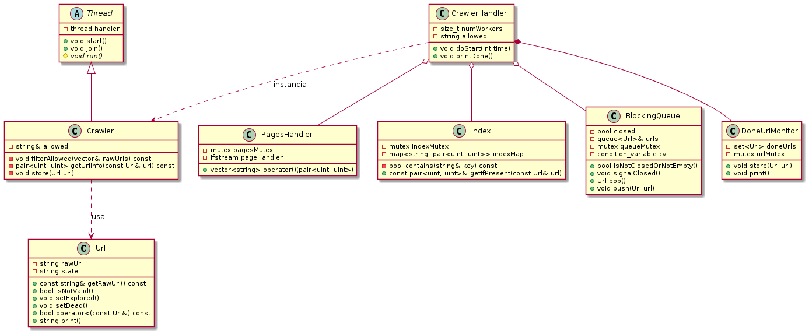

# TP2: Web Crawler 

- Nombre: Leonardo Giampieri Mutti
- Padron: 102358
- URL: https://github.com/leogm99/tp2

## Introduccion

En el siguiente trabajo, se desarrollo un programa multithreading que emula a Web Crawlers. Estos buscan en paginas web para encontrar enlaces a otras paginas. Puede descubrir el estado de las mismas y taggearlas para, por ejemplo, optimizar los resultados de un motor de busqueda, como Google. Como el programa emula el funcionamiento (no se conecta a web, aunque es un paso relativamente sencillo de dar), este se respalda con 3 archivos. `Index`, `Pages` y `Target`. Ademas, el programa debe recibir el tiempo que deberia tomar, a lo sumo, para terminar su trabajo, una url objetivo en las busquedas (esta deberia ser un filtro para el resto de las encontradas) y cuantos Workers se ejecutaran de manera concurrente, en paralelo si el Kernel asi quisiera. 
En este informe se mostrará el diseño del programa y algunas complicaciones que presentaron.
La idea de este trabajo es diseñar y construir una aplicacion entera Orientada a Objetos en C++ con capacidad multihilo, respetando principios del lenguaje como diseño de objetos que respeten RAII (Resource Acquisition Is Initialization), y lograr la proteccion de recursos compartidos por threads.

## Ejecucion

Se muestra como se puede correr el programa en la shell.

`./tp <TARGET> <ALLOWED_URL> <N_WORKERS> <INDEX> <PAGES> <TIME_SEC>`

Target, Index y Pages deben ser archivos válidos.

## Diseño

Se muestra a continuacion un diagrama de clases del diseño del programa.

Notamos que `CrawlerHandler` tiene referencias a `BlockingQueue`, `Index` y `PagesHadnler`, las cual comparte luego con `Crawler` para que este las pueda usar. Esto logra desacoplar la creacion de estos objetos de aquel que los debe usar, logrando reducir codigo innecesario para una clase y tratando de respetar el principio de unica responsabilidad. `Crawler` a su vez hereda de `Thread`, la cual es una clase abstracta por su metodo `run()`.
Todas las clases son movibles y no copiables. Los recursos compartidos estan protegidos por mutex y una de las zonas de exclusion mutua (en el metodo `pop()` de `BlockingQueue`) requiere el uso de Condition Variables. `Crawler` es el encargado de pedirle a `Index` la informacion de la pagina, a traves de su url. Luego, este puede revisar de esta estar disponible a traves de `PagesHandler`, que devuelve en base al archivo pages las urls encontradas en la seccion pedida por el `Crawler`. `CrawlerHandler` se encarga de instanciar a los workers y de darles un tiempo hasta cerrarlos y mantener el estado que vayan recuperando de las paginas encontradas. Al final, imprime ese estado a `stdout`.

## Problemas

Crawler: a la hora de crear el diseño de esta clase, no se sabia la cantidad de responsabilidad que deberia tener. En un principio, esta tenia un handler para el archivo pages, unico, el cual podia acceder en su propio contexto. Es decir, cada thread tenia su propio archivo pages. Al final se decidio remover esto, crear un handler unico (mediante PagesHandler), y que este sea excluyente. Al no cargarse en memoria el archivo, se debe mover el puntero del handler y esto implica escribir el estado del mismo, por lo tanto si el acceso es concurrente, este debe ser controlado (en este caso mediante mutex). Este cambio no tuvo un impacto negativo en performance, y de hecho necesita alojar menos recursos en el heap. Es cuestionable si esta clase deberia ser o no movible ya que sus atributos son puramente referencias, pero se decidio dejarlo de esa manera por el momento.

BlockingQueue: se tuvieron dudas a la hora de saber que tenia que devolver la queue en caso de haber cerrado. Al no tener fresco el manejo de excepciones en C++, se decidio devolver un objeto invalido que notifique a los hilos de que deben terminar su trabajo y salir de scope. 

General: en cuanto al archivo targets, al ser unicamente necesaria su construccion, se decidio no encapsularlo en un objeto sino encontrar las urls y directamente encolarlas (esto desde `main()`). A la hora de hacer un shutdown de la queue, no se sabia si los hilos debian ser notificados. No se encontro una mejora en performance al hacer que cada hilo tenga su propio handler para el archivo pages.

## Correciones

En primer lugar, la correcion mas importante que se hizo sobre el tp fue agregar un monitor para todos los Crawlers, `DoneUrlMonitor`, el cual protege el recurso compartido que son las Urls ya analizadas. Los crawlers, en vez de compartir un mutex y un mapa <url, state_url>, ahora comparten una referencia a un objeto de la clase `DoneUrlMonitor`, el cual tiene el mutex y un Set. 
La razon por la cual tiene un Set en vez de un Map es que ahora, las Urls ya no son un pair de strings sino que son un objeto que encapsula la url y el estado de la misma (este estado se puede setear mediante metodos), por ende, no hay nada que "mapear", solo hay que poner las urls ordenadas. El set logra que se introduzcan los objetos con un orden (sobrecarga de `operator <` en `Url`), y luego no se tenga que hacer un sort, como seria el caso de un vector por ejemplo. Por ende, ya no hay mas un objeto desprotegido que puede ser victima de una race condition o data race.

Se encapsula ahora la logica del archivo target en un objeto de la clase `TargetLoader`. Este se encarga de abrir el archivo, y cuando la `BlockingQueue` inicia, le pide que le cargue el target en la queue interna, con todas las Url's a analizar. Ademas, todos los objetos relacionados con la lectura de archivos (`TargetLoader`, `PageHandler` e `Index`) lanzan una excepcion si no pudieron abrir el archivo, que corta la ejecucion del proceso antes que este crashee, y logueando el mensaje de error.

Habia un pequeño bug en la logica del programa. Este requiere que los crawlers sigan trabajando a pesar de que la queue este cerrada, ya que esta puede estar no vacia. Como el proceso termina antes del tiempo de sleep del main thread, este bug se "silencio" y nunca se vio reflejado. Ahora, los crawlers llaman al metodo de la `BlockingQueue` `isNotClosedOrEmpty()` para continuar su ejecucion. Como dice el nombre, los crawlers continuan su ejecucion si la cola no esta cerrada **o** no esta vacia, es decir, si esta cerrada pero no esta vacia, continuan hasta que esté vacia. 

Se hicieron cambios mas pequeños tambien. Como sabemos la cantidad de crawlers en tiempo de compilacion, se hace un reserve al vector de crawlers. En index se cambia por std::stringstream que resulta menos verboso que separar el string manualmente. 
Las asignaciones por movimiento checkean ahora que el objeto que se este tratando de asignar no sea el mismo `(other == &this)`, ya qeu esto podria llevar a corromper el estado del objeto asignado (seguramente se corrompa si esto se deja pasar). Este es otro bug que estaba en la primera entrega.

Al introducir el objeto `Url`, `BlockingQueue` pasa a almacenar objetos de esta clase, y los crawlers tambien se manejan con estos mismos objetos.

Se agrega ahora el diagrama de clases actualizado, ademas corrigiendo que el primero tenia las referencias invertidas y se mostraban asociaciones cuando en realidad estas eran composiciones.

Notamos ahora que `CrawlerHandler` esta compuesto por un `DoneUrlMonitor`, y que tiene referencias a un objeto por cada clase de `PagesHandler`, `Index` y `BlockingQueue`. 
Cada `Crawler` es instanciado por `CrawlerHandler` en el metodo `doStart()`, que le forwardea los objetos necesarios para su ejecucion, por eso mismo cada Crawler depende de `CrawlerHandler`. A su vez, los crawlers usan `Ulr`'s, las cuales son pusheadas y popeadas a la queue. Estos setean los estados correspondientes mediante los metodos `setExplored()` y `setDead()`.

Finalmente, en cuanto a los comentarios realizados sobre la ejecucion mas o menos eficiente/veloz sobre algunos metodos, todo ha sido testeado localmente teniendo en cuenta el tiempo de ejecucion para cada tarea (logs que no se subieron a este informe y que no se han guardado).